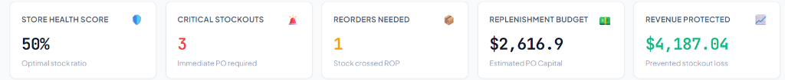

# 🛒 OptiRetail AI — Retail Store Optimization & Demand Forecasting

A full-stack, machine-learning-powered retail store operations and inventory optimization platform. Designed to automate demand forecasting, inventory replenishment, dynamic pricing elasticity, and cross-sell bundling with interactive visual analytics.

Built with **HTML5, CSS3, and Vanilla JavaScript** on the frontend, and **FastAPI + Scikit-Learn** on the backend.

---

## 📸 Executive Dashboard Preview



*Real-time executive KPI metrics and clickable intelligence cards: Store Health Score (50%), Critical Stockouts (3), Reorders Needed (1), Replenishment Budget ($2,616.90), and Revenue Protected ($4,187.04).*

---

## 🌟 Key Features

### 1. 🔮 ML-Driven Demand Forecasting
- Multi-variable **Random Forest Regressor** trained on sales velocity, 30-day moving trends, shelf price, active discount %, supplier lead time, competitor pricing, and store footfall multiplier.
- Real-time weekly and daily demand velocity calculations.
- Model persistence using `joblib` (`models/demand_model.joblib`).

### 2. 📦 Intelligent Inventory Replenishment & Safety Stock
- **Safety Stock ($SS$)**: Calculated as $SS = Z \times \sqrt{L} \times \sigma_D$ protecting against demand volatility at a 95% service level ($Z = 1.65$).
- **Reorder Point ($ROP$)**: $\text{ROP} = (\mu_{\text{daily}} \times L) + SS$.
- **Recommended Order Quantity ($ROQ$)**: Dynamic replenishment order calculation batching economic order quantities.
- **Stockout Probability Index**: Logistic curve estimating stockout probability before the next delivery arrives.
- **Automated Health Status**:
  - `CRITICAL_STOCKOUT` 🚨 — Stock depleted in fewer days than supplier lead time.
  - `REORDER_NEEDED` ⚠️ — Current stock has crossed the Reorder Point.
  - `OPTIMAL` 🟢 — Healthy inventory buffer.
  - `OVERSTOCKED` 🟣 — Holding excess stock; recommendations to apply promotional markdowns.

### 3. 🏷️ Dynamic Price Elasticity & Revenue Optimizer
- Interactive simulation testing prices from -30% to +30%.
- Calculates the exact profit-maximizing price point, balancing unit sales volume with gross margins.
- Visual revenue and gross profit trajectories rendered via Chart.js.

### 4. 🛍️ Market Basket Association & Synergy Bundles
- Uncovers cross-selling item affinities with statistical Lift, Support, and Confidence scores.
- Recommends bundle discounts to increase Average Order Value (AOV).

### 5. 📊 Interactive Visual Analytics (Chart.js)
- **Bar & Line Chart**: On-hand stock vs ML-predicted demand vs Reorder Point.
- **Donut Chart**: Live inventory health breakdown across all store SKUs.
- **Price Elasticity Curve**: Revenue and Gross Profit trajectory across price points.

### 6. ↕️ Multi-Column Increasing & Decreasing Sorting Engine
- One-click sorting toggle between **Increasing (Ascending)** and **Decreasing (Descending)** order.
- Sort by any metric: Current Stock, Shelf Price, ML Weekly Demand, Reorder Point (ROP), Recommended PO Units, Stockout Probability %, Category, or Product Name.
- Interactive column headers with active visual directional indicators (`▲` Ascending, `▼` Descending, `↕` Sortable).

---

## 📑 Dedicated Executive Sub-Pages

The platform features 5 dedicated sub-pages accessible via direct click on the executive KPI cards, the top navigation buttons, and the direct link toolbar:

| Page | URL | Key Metrics & Capabilities |
| :--- | :--- | :--- |
| **Store Health Score** | [`/health.html`](http://127.0.0.1:8000/health.html) | Overall catalog health ratio (50%), healthy buffer count, automated replenishment recommendations. |
| **Critical Stockouts** | [`/critical.html`](http://127.0.0.1:8000/critical.html) | High-urgency stockouts where stock < lead time demand. Fast-action PO approvals to prevent revenue loss. |
| **Reorders Needed** | [`/reorders.html`](http://127.0.0.1:8000/reorders.html) | SKUs that have crossed the calculated Reorder Point threshold (ROP). Automated PO queue generation. |
| **Replenishment Budget** | [`/budget.html`](http://127.0.0.1:8000/budget.html) | Itemized wholesale outlay ($2,616.90), expected retail yield ($4,187.04), profit margin analysis (37.5%). |
| **Revenue Protected** | [`/revenue.html`](http://127.0.0.1:8000/revenue.html) | Preserved revenue ($4,187.04) from averted stockouts. Explanatory mathematical formulas and ML model accuracy ($R^2 = 0.88$). |

*Note: All subpages use relative link paths (`index.html`, `style.css`), meaning navigation works seamlessly both when served via FastAPI (`http://127.0.0.1:8000/`) and when opened directly from the local file system (`file:///.../frontend/index.html`).*

---

## 📁 Project Architecture & Files

```
Retail Store Optimization/
│
├── docs/                         # Documentation Assets
│   └── dashboard_preview.png     # Executive KPI cards preview image
│
├── frontend/                     # Modern Web Client (HTML5 / CSS3 / Vanilla JS)
│   ├── index.html                # Executive KPI dashboard, Catalog, Simulator & Charts
│   ├── health.html               # Store Health Score analytics subpage
│   ├── critical.html             # Critical Stockouts & emergency PO queue subpage
│   ├── reorders.html             # Reorders Needed & ROP analysis subpage
│   ├── budget.html               # Replenishment Budget PO breakdown subpage
│   ├── revenue.html              # Revenue Protected & ML model assurance subpage
│   ├── style.css                 # Modern CSS design system (glassmorphism, status badges)
│   └── script.js                 # API connectors, Chart.js integrations, instant click handlers
│
├── backend/                      # Python FastAPI Service & ML Engine
│   ├── app/
│   │   ├── __init__.py
│   │   └── main.py               # FastAPI application, ML engine, endpoints, static file server
│   ├── train_model.py            # Random Forest model training pipeline script
│   ├── retail_training_data.csv  # 2,500 historical transaction rows used to train ML model
│   └── demand_model.joblib       # Persisted trained Random Forest model
│
├── models/
│   └── demand_model.joblib       # Persisted trained Random Forest model (9.6 MB)
│
├── requirements.txt              # Backend dependencies
└── README.md                     # Platform documentation
```

---

## 🔌 API Reference & Endpoints

| Method | Endpoint | Description |
| :--- | :--- | :--- |
| `GET` | `/` or `/index.html` | Serves main store dashboard. |
| `GET` | `/{page}.html` | Serves dedicated subpages (`health`, `critical`, `reorders`, `budget`, `revenue`). |
| `GET` | `/style.css` | Serves main stylesheet with `text/css` MIME type. |
| `GET` | `/script.js` | Serves client script with `application/javascript` MIME type. |
| `GET` | `/api/store-kpis` | Returns executive aggregate metrics (Health Score, Total Budget, Revenue Protected). |
| `POST` | `/api/optimize-all` | Runs ML inference over full 10-SKU store catalog with inventory recommendations. |
| `POST` | `/api/optimize-single` | Interactive simulator endpoint for custom SKU parameters. |
| `POST` | `/api/simulate-price` | Simulates demand, revenue, and profit curves across -30% to +30% price variations. |
| `GET` | `/api/market-basket` | Returns co-purchase bundles, statistical confidence, and synergy lift scores. |

---

## 🚀 Getting Started

### 1. Prerequisites
- **Python 3.9+** installed on your system.

### 2. Installation
Open your terminal in the project directory:
```bash
pip install -r requirements.txt
```

### 3. Run the Platform
Start the FastAPI backend with Uvicorn:
```bash
uvicorn backend.app.main:app --host 127.0.0.1 --port 8000 --reload
```

### 4. Access the Dashboard
- **Web Dashboard**: [http://127.0.0.1:8000/](http://127.0.0.1:8000/)
- **Interactive API Documentation (Swagger UI)**: [http://127.0.0.1:8000/docs](http://127.0.0.1:8000/docs)
- **Alternative Offline Access**: Open `frontend/index.html` directly in any web browser.

---

## 📐 Mathematical Formulation

### 1. Safety Stock ($SS$)
$$SS = Z \times \sqrt{L} \times \sigma_D$$
- $Z = 1.65$ (corresponding to a 95% cycle service level)
- $L$ = Supplier lead time in days
- $\sigma_D$ = Standard deviation of daily sales velocity

### 2. Reorder Point ($ROP$)
$$\text{ROP} = (\mu_D \times L) + SS$$
- $\mu_D$ = ML-predicted daily demand
- When $\text{Current Stock} \le \text{ROP}$, a replenishment trigger is fired.

### 3. Economic Reorder Quantity ($ROQ$)
$$\text{ROQ} = \max\left(0, (\text{Target Days of Supply} \times \mu_D) - \text{Current Stock}\right)$$

### 4. Revenue Protected
$$\text{Rev}_{\text{protected}} = \sum_{i=1}^{N} \left( \mu_{D,i} \times L_i \times P_i \right)$$
- Measures the monetary value of lost sales prevented by proactive safety buffer stock.

---

## 🛡️ License & Credits
Built for **Naviotech Retail Optimization Engine**.
Technology stack: FastAPI, Scikit-Learn, NumPy, Pandas, Chart.js, HTML5, CSS3, JavaScript.
